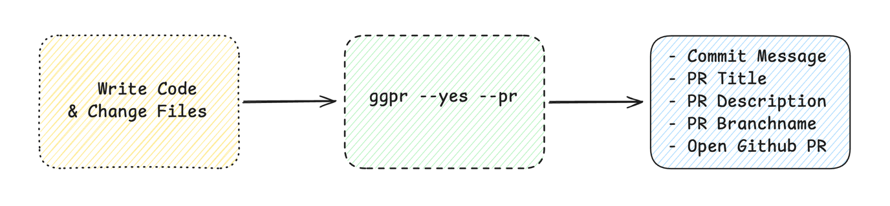

# 🚀 GGPR - PR & Commit AI Assistant

GGPR is an AI-powered CLI tool that **supercharges your Git workflow** by generating high-quality commit messages, branch names, and pull requests. Save time, improve documentation, and let AI handle the tedious parts of your development process! 🎉

[](https://www.npmjs.com/package/pr-commit-ai-agent)
[](https://opensource.org/licenses/MIT)
[](https://github.com/meabed/pr-commit-ai-agent/actions/workflows/ci.yml)

---

<p align="center">
  <a href="https://github.com/meabed/pr-commit-ai-agent/pulls?q=is%3Apr+is%3Aclosed">✨ See GGPR in action with real PRs and commits</a>
</p>

---

## 🌟 Why GGPR?

- 🕒 **Save Time**: No more writing commit messages or PR descriptions manually.
- 🧠 **AI-Powered**: Generate semantic, high-quality commit messages and PRs.
- 🔧 **Customizable**: Tailor prompts and workflows to your team's needs.
- 🌍 **Multiple AI Providers**: Choose from OpenAI, Anthropic, Ollama, DeepSeek, and more.
- 🔒 **Privacy-Friendly**: Use local models with Ollama for complete control.



---

[](https://asciinema.org/a/9G5YvfqaAJSfhMnVrSeqVqlVf)

---

## ✨ Features

- **AI-Generated Commit Messages**: Create semantic, best-practice commit messages.
- **Commit Optimization**: Improve existing commit messages with AI suggestions.
- **Smart Branch Names**: Generate descriptive branch names automatically.
- **Automated PR Creation**: Generate PR titles, descriptions, and create them in seconds.
- **Multiple LLM Support**: Choose from OpenAI, Anthropic, Ollama, or DeepSeek.
- **Local AI Integration**: Use local models via Ollama for privacy and speed.
- **GitHub CLI Integration**: Seamlessly create PRs via GitHub CLI.

---

## 📋 Requirements

- **Node.js** v18+
- **pnpm** (recommended) or npm
- **Git** v2.25+
- **GitHub CLI** (required for PR creation)

---

## 🛠️ Installation

### 1️⃣ Install GGPR

```bash
# Install globally with npm
npm install -g pr-commit-ai-agent

# Or with pnpm (recommended)
pnpm add -g pr-commit-ai-agent

# Install GitHub CLI (required for PRs)
brew install gh
```

---

### 2️⃣ Get Your API Keys 🔑

GGPR supports multiple AI providers. Some offer **free credits** to get started:

- 🌟 **[OpenRouter](https://www.openrouter.ai/)** - Free credits and models available!
- 🤖 **[OpenAI](https://platform.openai.com/signup)** - Industry-leading models.
- 🧠 **[Anthropic](https://www.anthropic.com/)** - Advanced AI models.
- 🔍 **[DeepSeek](https://deepseek.ai/)** - Specialized AI solutions.
- 🖥️ **[Ollama](https://ollama.com/)** - Local models for privacy.

---

### 3️⃣ Configure GGPR ⚙️

#### Option 1: Interactive Setup (Recommended)

```bash
# Run the interactive configuration wizard
ggpr config
```

#### Option 2: Use Environment Variables

```bash
# Set for current session
export LLM_PROVIDER=openai
export OPENAI_API_KEY=your_key_here

# Or pass inline for a single command
LLM_PROVIDER=ollama MODEL=qwen2.5-coder OLLAMA_BASE_URL=http://0.0.0.0:11434/api/generate ggpr
```

#### Option 3: Edit Configuration File

- Run `ggpr config` to locate the config file (e.g., `~/.config/pr-commit-ai-agent-nodejs/config.json`).
- Modify the file to set your preferred settings.

---

## 📝 Usage

### Create Command (Default)

Generate AI-enhanced commits, optimize messages, and create PRs.

```bash
# Basic usage (interactive)
ggpr

# Auto-confirm all prompts
ggpr --yes

# Log all LLM requests for debugging
ggpr --log-request

# Combine flags
ggpr --yes --log-request
```

### Info Command

Display repository information and status.

```bash
ggpr info

# Show detailed information
ggpr info --full
```

### Config Command

Manage your GGPR configuration settings.

```bash
ggpr config
```

---

## 🚶 Workflow

1. **Target Branch Selection**: Choose the branch for your PR.
2. **Uncommitted Changes**: Generate AI commit messages for your changes.
3. **Commit Optimization**: Improve existing commit messages.
4. **Branch Creation**: Create a branch with an AI-generated name.
5. **PR Creation**: Generate a PR with an AI-generated title and description.

---

## 🤝 Contributing

We welcome contributions of all sizes! Here's how you can help:

1. Fork the repo and create a new branch.
2. Make your changes and test them locally.
3. Submit a pull request with a clear description of your changes.

---

## 📄 License

This project is licensed under the MIT License - see the [LICENSE](./LICENSE) file for details.

---

<div align="center">
  <p>Made with ❤️ by <a href="https://github.com/meabed">Mohamed Meabed</a> and contributors</p>
  <p>
    <a href="https://github.com/meabed/pr-commit-ai-agent/stargazers">⭐ Star us on GitHub</a> •
    <a href="https://github.com/meabed/pr-commit-ai-agent/issues">🐛 Report Bug</a> •
    <a href="https://github.com/meabed/pr-commit-ai-agent/issues">✨ Request Feature</a>
  </p>
</div>
