# 🚀 GGPR - PR & Commit AI Assistant

GGPR is an AI-powered CLI tool that **supercharges your Git workflow** by generating high-quality commit messages, branch names, and pull requests. Save time, improve documentation, and let AI handle the tedious parts of your development process! 🎉

[](https://www.npmjs.com/package/pr-commit-ai-agent)
[](https://opensource.org/licenses/MIT)
[](https://github.com/meabed/pr-commit-ai-agent/actions/workflows/ci.yml)

---

<p align="center">
  <a href="https://github.com/meabed/pr-commit-ai-agent/pulls?q=is%3Apr+is%3Aclosed">✨ See GGPR in action with real PRs and commits</a>
</p>

---

## 🌟 Why GGPR?

- 🕒 **Save Time**: No more writing commit messages or PR descriptions manually.
- 🧠 **AI-Powered**: Generate semantic, high-quality commit messages and PRs.
- 🔧 **Customizable**: Tailor prompts and workflows to your team's needs.
- 🌍 **Multiple AI Providers**: Choose from OpenAI, Anthropic, Ollama, DeepSeek, and more.
- 🔒 **Privacy-Friendly**: Use local models with Ollama for complete control.


---

[](https://asciinema.org/a/9G5YvfqaAJSfhMnVrSeqVqlVf)

---

## ✨ Features

- **AI-Generated Commit Messages**: Create semantic, best-practice commit messages.
- **Commit Optimization**: Improve existing commit messages with AI suggestions.
- **Smart Branch Names**: Generate descriptive branch names automatically.
- **Automated PR Creation**: Generate PR titles, descriptions, and create them in seconds.
- **Multiple LLM Support**: Choose from OpenAI, Anthropic, Ollama, or DeepSeek.
- **Local AI Integration**: Use local models via Ollama for privacy and speed.
- **GitHub CLI Integration**: Seamlessly create PRs via GitHub CLI.

---

## 📋 Requirements

- **Node.js** v18+
- **pnpm** (recommended) or npm
- **Git** v2.25+
- **GitHub CLI** (required for PR creation and updates, ensure it's installed and authenticated with the necessary scopes)

---

## 🛠️ Installation

### 1️⃣ Install GGPR

```bash
# Install globally with npm
npm install -g pr-commit-ai-agent

# Or with pnpm (recommended)
pnpm add -g pr-commit-ai-agent

# Install GitHub CLI (required for PRs)
brew install gh

# Authenticate GitHub CLI with proper scopes
gh auth login --scopes repo,read:org,read:discussion,gist

# Verify GitHub CLI authentication status and scopes and ensure you have the necessary scopes
gh auth status

# Ensure you have the necessary scopes for PR management
# If required scopes are missing, refresh your token with:
gh auth refresh --scopes repo,read:org,read:discussion,gist
```

> **Note on GitHub Tokens**: If you use `GH_TOKEN` or `GITHUB_TOKEN` environment variables instead of `gh auth login`, ensure your personal access token has the following scopes: `repo`, `read:org`, `read:discussion`, and `gist`. These scopes are required for complete PR management functionality.

---

### 2️⃣ Get Your API Keys 🔑

GGPR supports multiple AI providers. Some offer **free credits** to get started:

- 🌟 **[OpenRouter](https://www.openrouter.ai/)** - Free credits and models available!
- 🤖 **[OpenAI](https://platform.openai.com/signup)** - Industry-leading models.
- 🧠 **[Anthropic](https://www.anthropic.com/)** - Advanced AI models.
- 🔍 **[DeepSeek](https://deepseek.ai/)** - Specialized AI solutions.
- 🖥️ **[Ollama](https://ollama.com/)** - Local models for privacy.

---

### 3️⃣ Configure GGPR ⚙️

#### Option 1: Interactive Setup (Recommended)

```bash
# Run the interactive configuration wizard
ggpr config
```

#### Option 2: Use Environment Variables

```bash
# Set for current session
export LLM_PROVIDER=openai
export OPENAI_API_KEY=your_key_here

# Or pass inline for a single command
LLM_PROVIDER=ollama MODEL=qwen2.5-coder OLLAMA_BASE_URL=http://0.0.0.0:11434/api/generate ggpr
```

#### Option 3: Edit Configuration File

- Run `ggpr config` to locate the config file (e.g., `~/.config/pr-commit-ai-agent-nodejs/config.json`).
- Modify the file to set your preferred settings.

---

## 📝 Usage

### Create Command (Default)

Generate AI-enhanced commits, optimize messages, and create PRs.

```bash
# Basic usage (interactive)
ggpr

# Auto-confirm all prompts
ggpr --yes

# Log all LLM requests for debugging
ggpr --log-request

# Combine flags
ggpr --yes --log-request
```

### Info Command

Display repository information and status.

```bash
ggpr info

# Show detailed information
ggpr info --full
```

### Config Command

Manage your GGPR configuration settings.

```bash
ggpr config
```

---

## 🚶 Workflow

1. **Target Branch Selection**: Choose the branch for your PR.
2. **Uncommitted Changes**: Generate AI commit messages for your changes.
3. **Commit Optimization**: Improve existing commit messages.
4. **Branch Creation**: Create a branch with an AI-generated name.
5. **PR Creation**: Generate a PR with an AI-generated title and description.

### Workflow Diagram

```mermaid
flowchart TD
    Start([Start GGPR]) --> InitConfig[Initialize Configs & Settings]
    InitConfig --> GitStatus[Get Git Status]
    GitStatus --> BranchCheck{Determine\nTarget Branch}
    
    %% Branch Selection Flow
    BranchCheck -->|Find Tracking Branch| TrackingExists{Tracking\nBranch Exists?}
    TrackingExists -->|Yes| ConfirmTracking{Confirm\nTracking Branch?}
    TrackingExists -->|No| FetchRemotes[Fetch Remote Branches]
    ConfirmTracking -->|Yes| UseTracking[Use Tracking Branch]
    ConfirmTracking -->|No| FetchRemotes
    FetchRemotes --> UserSelectBranch[User Selects Branch]
    UserSelectBranch --> ConfirmBranch{Confirm\nBranch Selection?}
    ConfirmBranch -->|Yes| TargetBranchSet[Set Target Branch]
    ConfirmBranch -->|No| ExitProcess([Exit Process])
    UseTracking --> TargetBranchSet
    
    %% Uncommitted Changes Flow
    TargetBranchSet --> CheckChanges{Working Dir\nClean?}
    CheckChanges -->|Yes| OptimizeCommits[Optimize Commit Messages]
    CheckChanges -->|No| HandleChanges{Commit\nChanges?}
    HandleChanges -->|No| ExitProcess
    HandleChanges -->|Yes| AnalyzeChanges[Analyze Changes with AI]
    AnalyzeChanges --> CollectModified[Collect Modified Files]
    CollectModified --> GetDiffs[Get Diffs for Each File]
    GetDiffs --> AskAI{Send to AI\nfor Analysis?}
    AskAI -->|No| ExitProcess
    AskAI -->|Yes| GenerateCommitMsg[Generate Commit Message]
    GenerateCommitMsg --> ConfirmCommit{Proceed with\nCommit?}
    ConfirmCommit -->|No| ExitProcess
    ConfirmCommit -->|Yes| CreateCommit[Create Commit]
    CreateCommit --> MarkCommit[Mark as Created by Tool]
    MarkCommit --> OptimizeCommits
    
    %% Optimize Commits Flow
    OptimizeCommits --> CommitsExists{Commits to\nOptimize?}
    CommitsExists -->|No| CheckPRFlag
    CommitsExists -->|Yes| OptimizeConfirm{Optimize\nCommits?}
    OptimizeConfirm -->|No| CheckPRFlag
    OptimizeConfirm -->|Yes| CheckLastCommit[Check Last Commit]
    CheckLastCommit --> IsCreatedByTool{Created by\nThis Tool?}
    IsCreatedByTool -->|Yes| CheckPRFlag
    IsCreatedByTool -->|No| IsMergeCommit{Is Merge\nCommit?}
    IsMergeCommit -->|Yes| CheckPRFlag
    IsMergeCommit -->|No| AnalyzeCommit[Analyze with Full Context]
    AnalyzeCommit --> AINeedsImprovement{Needs\nImprovement?}
    AINeedsImprovement -->|No| MarkNoChanges[Mark as Processed]
    AINeedsImprovement -->|Yes| ConfirmAmend{Amend\nCommit?}
    ConfirmAmend -->|No| CheckPRFlag
    ConfirmAmend -->|Yes| AmendCommit[Amend Commit Message]
    AmendCommit --> MarkAmended[Mark as Created by Tool]
    MarkAmended --> CheckPRFlag
    MarkNoChanges --> CheckPRFlag
    
    %% PR Creation Flow
    CheckPRFlag{Create PR?} -->|No| Complete([Complete])
    CheckPRFlag -->|Yes| ConfirmPR{Proceed with\nCreating PR?}
    ConfirmPR -->|No| Complete
    ConfirmPR -->|Yes| CheckExistingPR[Check for Existing PR]
    CheckExistingPR --> ExistingPR{PR Already\nExists?}
    
    %% Existing PR Flow
    ExistingPR -->|Yes| ConfirmUpdate{Update\nExisting PR?}
    ConfirmUpdate -->|No| GeneratePRDetails
    ConfirmUpdate -->|Yes| PushToExisting[Push to Existing PR]
    PushToExisting --> CheckNewCommits[Check for New Commits]
    CheckNewCommits --> UpdatePRDesc{Update PR\nDescription?}
    UpdatePRDesc -->|No| Complete
    UpdatePRDesc -->|Yes| GenerateUpdatedDesc[Generate Updated Title/Description]
    GenerateUpdatedDesc --> ConfirmUpdateDesc{Apply\nUpdates?}
    ConfirmUpdateDesc -->|No| Complete
    ConfirmUpdateDesc -->|Yes| UpdatePR[Update PR Title/Description]
    UpdatePR --> Complete
    
    %% New PR Flow
    ExistingPR -->|No| GeneratePRDetails[Generate PR Details with AI]
    GeneratePRDetails --> ConfirmPRDetails{Create PR with\nthese Details?}
    ConfirmPRDetails -->|No| Complete
    ConfirmPRDetails -->|Yes| CheckBranchTarget{Current Branch\nis Target?}
    CheckBranchTarget -->|Yes| CreateNewBranch[Create New Branch]
    CheckBranchTarget -->|No| UseCurrentBranch[Use Current Branch]
    CreateNewBranch --> ConfirmNewBranch{Confirm New\nBranch?}
    ConfirmNewBranch -->|No| Complete
    ConfirmNewBranch -->|Yes| CreateBranch[Create Branch]
    CreateBranch --> PushBranch
    UseCurrentBranch --> PushBranch[Push Branch to Remote]
    PushBranch --> CreatePRWithGH{Create PR using\nGitHub CLI?}
    CreatePRWithGH -->|No| ShowManualInstructions[Show Manual PR Instructions]
    CreatePRWithGH -->|Yes| GHCliAvailable{GitHub CLI\nAvailable?}
    GHCliAvailable -->|No| ShowManualInstructions
    GHCliAvailable -->|Yes| CreatePRGH[Create PR with GitHub CLI]
    CreatePRGH --> PRSuccess[PR Created Successfully]
    ShowManualInstructions --> Complete
    PRSuccess --> Complete
    
    classDef processNode fill:#d4f1f9,stroke:#0e5974,stroke-width:1px;
    classDef decisionNode fill:#ffe6cc,stroke:#d79b00,stroke-width:1px;
    classDef startEndNode fill:#d5e8d4,stroke:#82b366,stroke-width:2px;
    classDef errorNode fill:#f8cecc,stroke:#b85450,stroke-width:1px;
    
    class Start,Complete,ExitProcess startEndNode;
    class BranchCheck,TrackingExists,ConfirmTracking,ConfirmBranch,CheckChanges,HandleChanges,AskAI,ConfirmCommit,CommitsExists,OptimizeConfirm,IsCreatedByTool,IsMergeCommit,AINeedsImprovement,ConfirmAmend,CheckPRFlag,ConfirmPR,ExistingPR,ConfirmUpdate,UpdatePRDesc,ConfirmUpdateDesc,ConfirmPRDetails,CheckBranchTarget,ConfirmNewBranch,CreatePRWithGH,GHCliAvailable decisionNode;
    class ExitProcess errorNode;
    class InitConfig,GitStatus,FetchRemotes,UserSelectBranch,TargetBranchSet,AnalyzeChanges,CollectModified,GetDiffs,GenerateCommitMsg,CreateCommit,MarkCommit,OptimizeCommits,CheckLastCommit,AnalyzeCommit,MarkNoChanges,AmendCommit,MarkAmended,CheckExistingPR,PushToExisting,CheckNewCommits,GenerateUpdatedDesc,UpdatePR,GeneratePRDetails,CreateNewBranch,UseCurrentBranch,CreateBranch,PushBranch,ShowManualInstructions,CreatePRGH,PRSuccess processNode;
```



---

## 🤝 Contributing

We welcome contributions of all sizes! Here's how you can help:

1. Fork the repo and create a new branch.
2. Make your changes and test them locally.
3. Submit a pull request with a clear description of your changes.

---

## 📄 License

This project is licensed under the MIT License - see the [LICENSE](./LICENSE) file for details.

---

<div align="center">
  <p>Made with ❤️ by <a href="https://github.com/meabed">Mohamed Meabed</a> and contributors</p>
  <p>
    <a href="https://github.com/meabed/pr-commit-ai-agent/stargazers">⭐ Star us on GitHub</a> •
    <a href="https://github.com/meabed/pr-commit-ai-agent/issues">🐛 Report Bug</a> •
    <a href="https://github.com/meabed/pr-commit-ai-agent/issues">✨ Request Feature</a>
  </p>
</div>
